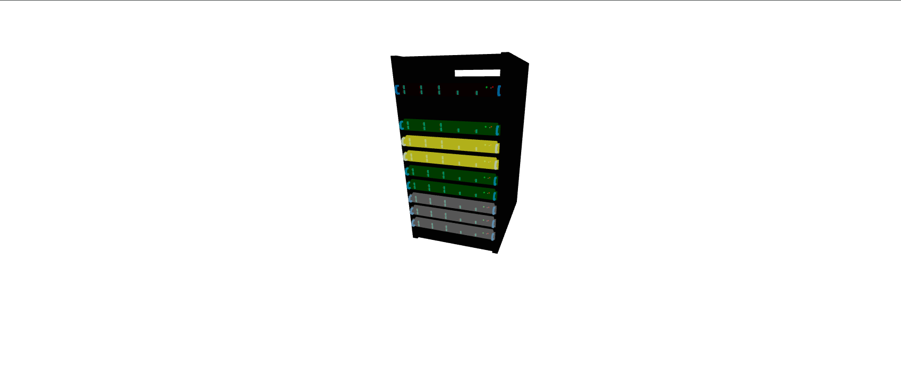
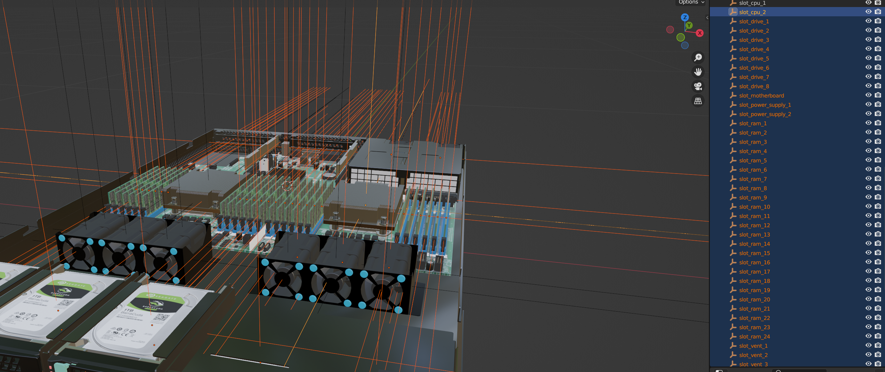
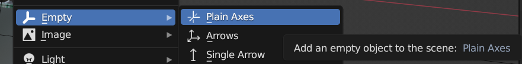

# R3F Modular Mesh Component Lib

MV - компонентная библиотека для визуализации модульных объектов. 

В первую очередь, проект разработан для визуализации систем мониторинга серверного оборудования.

## Используемые типы данных
Для работы с библиотекой, вам понадобится ознакомится с типами данных, используемых новыми компонентами:

#### 1. Module
```ts
Module {
    name?: string, // Название детали.
    path: string, // URL до модели в формате glb или gltf.
    slot?: string, // Название слота родительской модели, в который будет вставлена данная деталь.

    isMonitored: boolean, // Будет ли визуализироваться статус детали.
    status?: string, // Статус детали.

    isSelectable: boolean, // Может ли пользователь выбрать деталь.
    message?: string, // Сообщение пользователю о состоянии детали.

    isMovable: boolean, // Может ли пользователь переместить деталь.
    travelV3?: Array<number>, // Вектор3, на который переместится деталь.
    isMovedByDefault?: boolean, // Будет ли деталь перемещена при изициализации модели.

    isParent: boolean, // Является ли деталь родителем для других деталей.
    components?: Array<Module> // Массив дочерних деталей.
}
```
Критически важный тип данных. ```Module``` используется для создания ```ModularBuilder``` и ```ModularMesh```

#### 2. ModularScene
```ts
ModularScene {
    sceneName?: string, // Название глобальной сцены.
    models: Array<Module> // Массив используемых деталей.
}
```
Подразумевается, что данный тип данных будет использоваться для работы с ```ModularBuilder```, однако ему хватает и простого ```Module[]```

#### 3. StatusEffect
```ts
StatusEffect {
        signature?: string; //Название статуса.
        displayMode?: "blink" | "static" | "fade"; // Тип визуализации.
        targetRGB?: Array<number>; // Финальный цвет для визуализации.
        speed?: number; // Скорость визуализации.
}
```
Эффект может иметь следующую анимацию:

1. blink: ```color``` = sin(deltaTime * speed) * targetRGB
2. static: ```color``` = targetRGB
3. fade: ```color``` = (sin(deltaTime * speed) * 0.5 + 0.5) * targetRGB

## Новые компоненты
На данный момент библиотека добавляет 2 новых компонента: ```ModularMesh``` - рекурсивно генерируемый меш и ```ModularBuilder``` - супервизор ModularMesh

#### ModularMesh
Компонент, визуализирующий деталь и ее детей.
```ts
ModularMeshProps {
    selection: { get: Module | null, set: (comp: Module | null) => void }; // Получение и изменение информации о выбранной пользователем детали.
    selectionEffect: StatusEffect; // Эффект, который будет проигрываться при выборе детали.
    data: Module; // Основная информация для визуализации детали.
    debug: boolean; // Будет ли в консоль выводится информация для отладки.
    position: Array<number>; // Относительное положение модели.
    statuses: Array<StatusEffect> // Массив со всеми эффектами и статусами, добавленными в ModularBuilder
}
```

#### ModularBuilder
Компонент, агрегатор, супервизор и менеджер для ```ModularMesh```
```ts
ModularBuilderProps {
    selection?: (comp: Module | null) => void; // Функция, в которую будет передаваться информация детали, выбранной пользователем.
    models: Array<Module> // Массив всех деталей задействованных на сцене.
    statuses: Array<StatusEffect> // Описания визуализации статусов, используемых в деталях.
    position?: Vector3 // Изначальное положение "центра" сцены с деталями.
    debug?: boolean // Будет ли в консоль выводится информация для отладки.
    selectionEffect?: StatusEffect // Эффект, который будет проигрываться при выборе детали.
}
```
При инициализации заполняет пропущенные необязательные поля props стандартными значениями:
```ts
position = [0,0,0]
selection = undefined
debug = false
selectionEffect = {
    displayMode: "blink",
    targetRGB: [0, 0.19, 0.2],
    speed: 10
}
```

## Пример использования
```ts
...
    const [selectedInfo, setInfo] = useState<Module | null>(null)
    return <>
        {/* Стандартная инициализация среды для R3F */}
        <Canvas camera={{ position: [0.5, 0.5, 0.5] }} 
            style={{ width: "100vw", height: "100vh"}} 
            >
            <ambientLight intensity={1} />
            <OrbitControls />

            <ModularBuilder 
                models={shelfModelInfo.models} 
                statuses={shelfStatusInfo} 
                position={[0, 0, 0]} 
                selectionEffect={{
                displayMode: "static",
                targetRGB: [1, 0.19, 0.2],
                speed: 10}} 
                selection={setInfo} />
        </Canvas>
    </>
...
```
Результат:



Более подробные примеры можно найти в директориях с компонентами внутри ```src``` в формате ```storybook```. 

Для локального запуска используйте:
```sh
npm i
npm run storybook
```

## Описание входных данных
Для использования полного функционала библиотеки, вам необходимо использовать корректные трехмерные модели для деталей. 

К моделям предоставляется следуюзий список требований:

1. Формат glb, либо gltf
2. Добавление невидимой геометрии / точек (Object3D в R3F) для установления положения слотов на исходной модели. Их названия и положения используются библиотекой для позиционирования дочерних деталей на детали, имеющей эти точки.

В Blender, например, такая геометрия может быть добавлена следующим образом:



